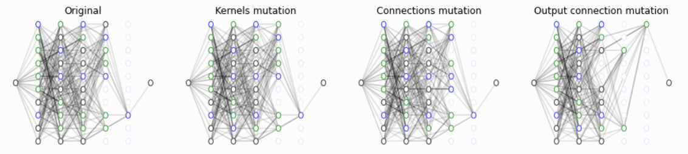

# Summary

Genetic Programming (GP), is a computer technique based on the idea of representing a computer program as some sort of tree (data-structure) and evolving it using genetic algorithms as to improve its *fitness* at solving a predefined task. The idea flourished in the late 80s mainly thanks to the work of John Koza [@koza:2010], and (using the words of Koza) has always had a major *skeleton in the closet*: the difficulty to find and evolve real valued parameters in the expressed program. A recent development called **differentiable
genetic programming** [@izzo:2017], was introduced to address exactly this issue by allowing to learn constants in computer programs using the
differential information of the program outputs as obtained using automated differentiation techniques. 

The evolution of a **differentiable genetic program** can be supported by using the information on the derivatives of the program outputs with respect to chosen parameters, enabling in GP the equivalent of back-propagation in Artificial Neural Networks (ANN). The fitness of a program can thus be defined in terms of the derivatives, allowing to go beyond symbolic regression tasks and, for example, to solve differential equations, learn differential models, capture conserved quantities in dynamical systems, search for Lyapunov functions in controlled systems, etc..

In this work we introduce the C++ library `dcgp` exposed in the Python package `dcgpy`, a tool that allows research into the applications enabled by **differentiable genetic programming**.

# Methods 

In `dcgp` computer programs are encoded using the Cartesian Genetic Programming (CGP) encoding [@miller:2011], that is an acyclic graph
representation of the program. A Cartesian genetic program, in its original form, is depicted in \autoref{fig:cgp}, and is defined by the number of inputs $n$, the number of outputs $m$, the number of rows $r$, the number of columns $c$, the levels-back $l$, the arity $a$ of its functional units (*kernels*) and the set of possible *kernels*. With reference to \autoref{fig:cgp}, each of the $n + rc$ nodes in a CGP is assigned a unique id. The vector of integers:
$$
\mathbf x_I = [F_0, C_{0,0}, C_{0,1}, ...,  C_{0, a}, F_1, C_{1,0}, ....., O_1, O_2, ..., O_m]
$$
defines entirely the value of the terminal nodes and thus the computer program.


In `dcgp` the CGP representations are all derived from the basis templated class `dcgp::expression<T>`. The use of the
templated parameter `T` allows to compute using different types the nodes of the acyclic graph defining the computer program.
In particular, the use of generalized dual numbers, as implemented in the library `audi` [@audi:2020], allow to obtain
derivatives of the program outputs with respect to parameters present in the program encoding by 
implementing the algebra of truncated Taylor polynomials (essentially a high order, forward mode, automated differentiation method).

The two classes `dcgp::expression_weighted<T>` and `dcgp::expression_ann` derive from the base class `dcgp::expression<T>` and offer
new, extended, kinds of CGP representations. `dcgp::expression_weighted<T>` adds a weight to each node connection and thus creates a program rich in floating point constants to be learned.  `dcgp::expression_ann` adds also a bias thus making it possible to obtain for the resulting program to represent generic artificial neural networks. Since forward mode automated differentiation is highly unefficient when a high number of parameters are to be learned (a typical situation when training ANN weights and biases), ```dcgp::expression_ann``` only operates on the type ```double``` and its weights and biases are learned using backward mode automated differentiation (back propagation) and a stochastic gradient descent implemented specifically for the class.

All computer programs represented by a form of CGP can be *mutated* calling the corresponding methods of the ```dcgp::expression<T>``` base class, and thus evolved. In the case of use of a `dcgp::expression<T>` in a symbolic regression task, several evolutionary startegies,
memetic and multiobjective, are provided in the library.




# Notes on efficiency (and parallel strategies implemented)

# C++ and Python APIs

Two separate APIs are maintained for the C++ and Python version of the code. While the APIs are
designed to be as close as possible, and to offer a similar experience, there are inevitable differences
stemming from the very different capabilities of the languages (to mention one, think about the
lack of an equivalent to C++ templates in Python).

In Python a typical initial use of the `dcgpy` package, would look like:
```python
import dcgpy
ks = dcgpy.kernel_set_double(["sum", "diff", "div", "mul"])
ex = dcgpy.expression_double(inputs = 1, outputs = 1, rows = 1, 
                cols = 6, levels_back = 6, arity  = 2, kernels = ks())
print("Numerical output: ", ex([1.2]))
print("Symbolic output: ", ex(["x"]))
ex.mutate_active(2)
print("Numerical output: ", ex([1.2]))
print("Symbolic output: ", ex(["x"]))
```
and produce the output:

```bash
Numerical output:  [1.7]
Symbolic output:  ['((x/(x+x))+x)']
Numerical output:  [1.68]
Symbolic output:  ['((x*(x+x))-x)']

```
while in C++ the same would be achieved by: 
```c++
#include <dcgp.hpp>
int main() {
    dcgp::kernel_set<double> ks({"sum", "diff", "div", "mul"});
    dcgp::expression<double> ex(1u, 1u, 1u, 6u, 6u, 2u, ks());
    std::cout << "Numerical output: ", ex({1.2})) << "\n";
    std::cout << "Symbolic output: ", ex({"x"})) << "\n";
    ex.mutate_active(2);
    std::cout << "Numerical output: ", ex({1.2})) << "\n";
    std::cout << "Symbolic output: ", ex({"x"})) << "\n";
```


# Acknowledgments

# References